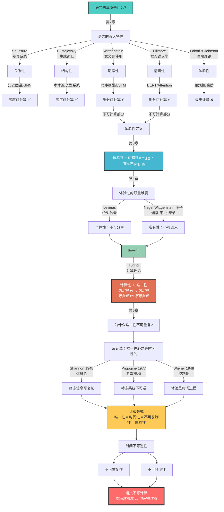

# 为什么语义无法被计算？
Why Can't Semantics Be Computed?

## 1. 为什么 RAG 不适合作为 AI 的记忆？

> **TL;DR**
> 
> RAG 的根本缺陷在于它丢失了语义性，而语义恰恰是记忆和理解的核心。

在上一篇文章中[《为什么RAG不能用于AI记忆?》](https://deepractice.ai/blog/rag-not-all)，我们详细分析了 RAG 的本质问题：

- **语义损失**：RAG 通过向量化压缩了丰富的语义信息，导致"我喜欢吃草莓"变成"我喜欢吃草"
- **片段化检索**：将完整的认知单元切割成碎片，破坏了意义的完整性
- **符号与意义的鸿沟**：计算只能处理符号，无法触及真正的意义

我们用了一个对比来说明这个鸿沟：

| RAG 的世界（符号层） | 真正的记忆（语义层） |
|-------------------|------------------|
| 向量相似度 | 意义关联 |
| 片段匹配 | 整体理解 |
| 统计规律 | 认知模式 |
| 信息检索 | 经验重构 |

这个对比揭示了一个更深层的问题：**如果语义是记忆的核心，而 RAG 恰恰丢失了语义，那么语义到底是什么？更重要的是，语义能被计算吗？**

这个问题不仅关系到 RAG 的局限性，更关系到 AI 能否真正理解和思考的根本问题。要回答这个问题，我们需要先理解语义的本质。

## 2. 语义的本质是什么？

> **TL;DR**
> 
> 语义不是符号的属性，而是关系、动态、情境、体验和结构的复杂交织。

要理解语义为什么难以计算，我们需要先理解语义到底是什么。语言学和认知科学的研究揭示了语义的五大本质特征：

### 关系性（Relational Nature）

Saussure 在其开创性著作中指出，语言是一个差异系统，意义来自于对比和关系[1]。没有任何词汇是孤立存在的：

- "大"的意义依赖于"小"的存在
- "父亲"的意义需要"孩子"来定义
- "红色"的意义在与其他颜色的区分中产生

Firth 进一步提出了著名的语境论："你应该通过一个词的伙伴来认识它"[2]。词的意义由其上下文分布决定，这成为了现代分布式语义学的理论基础。

### 动态性（Dynamic Nature）

Wittgenstein 在《哲学研究》中提出了革命性的观点："意义即使用"（Meaning is use）[3]。语义不是固定的，而是在特定语境中的使用中不断变化：

- 同一个词在不同时代有不同含义
- 同一个词在不同语境中表达不同意思
- 新的使用方式创造新的意义

他用"语言游戏"的概念说明，理解一个词就像理解游戏规则，需要参与到具体的使用情境中。

### 情境性（Contextual Nature）

Fillmore 的框架语义学理论表明，理解一个词需要激活整个认知框架[4]。例如：

- 理解"买"需要激活包含买家、卖家、商品、价格的整个商业框架
- 理解"星期二"需要理解整个星期系统
- 理解"岸边"需要理解陆地与水体的关系

脱离了这些框架和情境，词汇就失去了意义。

### 体验性（Experiential Nature）

Lakoff 和 Johnson 在《我们赖以生存的隐喻》中提出，人类的思维本质上是隐喻性的，抽象概念通过具体经验来理解[5]：

- "人生是一场旅程"（用空间体验理解时间）
- "争论是战争"（用身体冲突理解言语交锋）
- "理论是建筑"（用物理结构理解抽象体系）

这种基于身体经验的概念化过程，是语义形成的根本机制。

### 结构性（Structural Nature）

Pustejovsky 的生成词汇理论提出了语义的四层结构[6]：

1. **论元结构**：参与者角色
2. **事件结构**：过程类型
3. **物性结构**：构成、功能、起源、目的
4. **继承结构**：类型层级关系

这种有组织的认知框架使得我们能够理解复杂的概念组合和创新用法。

### 理论综合

这五大特性共同构成了语义的本质。正如 Gärdenfors 在概念空间理论中所说，概念是多维认知空间中的区域，意义是这个空间中的几何结构[7]。

但这就引出了一个关键问题：**这些特性中，哪些可以被计算，哪些不能？**

## 3. 哪些语义特性可以被计算？

> **TL;DR**
> 
> 关系性和结构性高度可计算，动态性和情境性部分可计算，但体验性几乎无法计算。

让我们逐一分析这五大特性的可计算性：

### 关系性 - 高度可计算 ✅

关系性是最容易被计算的语义特性。图论和网络科学为此提供了成熟的理论基础[8]：

**已有实现：**
- **知识图谱**：Neo4j、RDF 三元组完美表达概念间的关系
- **图神经网络**（GNN）：通过消息传递机制学习关系模式[9]
- **Word2Vec**：基于分布假说，通过共现关系学习词向量[10]

```
# 关系可以表示为图
G = (V, E)  # 节点和边
semantic_triple = ("苹果", "是一种", "水果")
```

**局限性：**
- 只能模拟显式关系，隐含关系需要推理
- 关系的强度和质量难以精确量化

### 结构性 - 高度可计算 ✅

结构性同样具有很高的可计算性。形式语法和类型论提供了坚实的理论基础[11]：

**已有实现：**
- **本体论系统**：OWL、Protégé 等工具构建概念层级
- **类型系统**：编程语言中的类型检查机制
- **句法分析**：依存句法、成分句法的自动分析

**成功案例：**
WordNet 成功构建了英语词汇的层级结构，包含 117,000 个同义词集[12]。

### 动态性 - 部分可计算 ⚡

动态性的计算面临时间维度的挑战：

**可计算部分：**
- **在线学习**：通过增量学习捕捉概念演化[13]
- **时序模型**：LSTM、Transformer 可以建模序列变化[14]
- **版本控制**：像 Git 一样追踪语义的历史变化

**不可计算部分：**
- **意义的突变**：新隐喻的创造性使用
- **文化演化**：社会事件对词义的影响
- **个体差异**：每个人对词义演化的独特理解

### 情境性 - 部分可计算 ⚡

情境性的计算在技术上有所突破，但仍有根本限制：

**可计算部分：**
- **BERT 的双向编码**：考虑前后文信息[15]
- **Attention 机制**：动态聚焦相关上下文[16]
- **对话状态追踪**：维护多轮对话的语境

**不可计算部分：**
- **文化背景**：不同文化中的微妙含义差异
- **隐含知识**：对话双方共享但未言明的背景
- **社会语境**：权力关系、社交距离等因素

### 体验性 - 极难计算 ❌

**关键定义：体验性 = 动态性的不可计算部分 × 情境性的不可计算部分**

体验性不是一个独立的特性，而是动态性和情境性中无法被计算的部分的交织：

**从动态性继承的不可计算性：**
- **个人意义演化**：每个人的词义变化轨迹是独特的
- **创造性使用**：新的隐喻和意义的涌现
- **不可逆的时间性**：过去的理解无法完全重现

**从情境性继承的不可计算性：**
- **个人认知背景**：独特的知识结构和经历
- **隐含的个人联想**：未言明但影响理解的记忆
- **主观的关联网络**：个人化的概念连接方式

**为什么是相乘而非相加：**
这两个维度不是简单叠加，而是相互作用：
- 动态性使得每个时刻的情境都是新的
- 情境性使得每次演化都有不同的方向
- 两者交织产生了指数级的复杂性

**经典例子：**

**1. 一千个读者，一千个哈姆雷特**
莎士比亚写下哈姆雷特时，文本是固定的（可计算的结构），但是：
- **动态维度**：不同时代的读者赋予不同解读（文艺复兴 vs 现代）
- **情境维度**：每个读者带着自己的人生经历（丧父之痛、复仇冲动、哲学思考）
- **体验性**：每个人心中的哈姆雷特都是独一无二的

这不是理解的"错误"，而是语义的本质——意义在个体体验中生成。

**2. 维特根斯坦的颜色悖论**
当我说"这是红色"时：
- **可计算部分**：光波长 700nm（物理事实）
- **不可计算部分**：你看到的"红"和我看到的"红"是否相同？
- **体验性悖论**：我们永远无法验证彼此的红色体验是否一致

即使我们都指着同一个物体说"红色"，我们的内在体验可能完全不同。

**3. "成功"的个体差异**
- **企业家的"成功"**：创造价值、改变世界
- **艺术家的"成功"**：自我表达、获得认可
- **普通人的"成功"**：家庭幸福、生活安稳
- **学者的"成功"**：追求真理、传播知识

同一个词，每个人基于自己的价值观和人生轨迹，构建了完全不同的语义空间。

**4. "鸡你太美"的语义演化**
- **原始语境**：一句普通的歌词
- **网络演化后**：成为特定的网络梗
- **个体理解差异**：
  - 年轻网民：幽默梗、娱乐符号
  - 不了解背景的人：莫名其妙的词组
  - 粉丝群体：可能是支持或调侃
  - 路人视角：网络文化现象

这个例子完美展示了动态性（网络文化演化）× 情境性（不同群体认知）= 体验性（独特理解）。

这就是为什么体验性成为语义不可计算的核心——它是时间和个体的双重烙印。

### 可计算性总结

| 特性 | 可计算程度 | 关键技术 | 主要障碍 |
|------|------------|----------|----------|
| 关系性 | ⭐⭐⭐⭐⭐ | 图数据库、知识图谱 | 隐含关系的发现 |
| 结构性 | ⭐⭐⭐⭐⭐ | 本体论、类型系统 | 结构的自动发现 |
| 动态性 | ⭐⭐⭐ | 时序模型、在线学习 | 创新和突变 |
| 情境性 | ⭐⭐⭐ | 注意力机制、BERT | 文化和隐含知识 |
| 体验性 | ⭐ | 多模态学习 | 主观性、感质 |

这个分析揭示了一个关键发现：**在所有语义特性中，体验性是唯一真正难以计算的。那么，体验性到底是什么？为什么它如此特殊？**

## 4. 什么是体验性？

> **TL;DR**
> 
> 体验性的两个核心维度——个体性和私有性——共同指向一个终极特性：唯一性。

在上一节我们发现，体验性 = 动态性的不可计算部分 × 情境性的不可计算部分。但体验性到底意味着什么？让我们深入分析它的本质。

### 体验性的两个核心维度

**1. Individual（个体性）- 不可分享（复制）**

每个人的理解都是基于自己独特的认知结构。Levinas 在《总体与无限》中提出，每个个体都是绝对的"他者"（Other），具有不可还原的独特性[20]：

> "他者的面容在每个时刻都摧毁并溢出了它留给我的塑料般的形象。"

这种个体性体现在：
- 我理解的"成功"基于我的价值观和人生轨迹
- 你理解的"成功"基于你的独特经历
- 即使我们都说"成功"，我们指向的语义空间可能截然不同

正如一千个读者心中有一千个哈姆雷特，每个人基于自己的人生经历，构建了独一无二的理解。

**2. Private（私有性）- 不可进入（访问）**

私有性包含了两个层面：体验既无法被观察，也无法被完全传达。

**不可观察的维度**：Nagel 在"蝙蝠"论文中的思想实验[21]：

> "即使我能够逐渐地被转变成一只蝙蝠，我现在的构成中也没有任何东西能让我想象出，未来那个变形后的自己会有怎样的体验。"

这与庄子的"濠梁之辩"异曲同工：

> 惠子曰："子非鱼，安知鱼之乐？"
> 庄子曰："子非我，安知我不知鱼之乐？"

**不可言说的维度**：Wittgenstein 的"甲虫盒子"思想实验[22]：

> "假设每个人都有一个盒子，里面装着某个东西：我们称之为'甲虫'。没有人能看到别人盒子里的东西，每个人都说他只是通过看自己的甲虫才知道什么是甲虫。"

这种双重的私有性意味着：
- 体验无法被外部观察（神经科学只能看到大脑活动，不能看到"理解"）
- 体验无法被语言完全传达（"痛"这个词无法传递痛的感觉）
- 我们被永远锁在自己的第一人称视角中

### 二维指向唯一性

这两个维度共同指向一个终极特性——**唯一性（Uniqueness）**：

**Individual → Unique**：因为每个人都是独特的个体

**Private → Unique**：因为无法进入（观察和传达）就无法复制

### 为什么唯一性如此关键？

唯一性意味着：
- **不可重复**：无法通过重复实验来验证
- **不可比较**：无法建立客观的比较标准
- **不可归纳**：无法从个案推导出普遍规律


**而这恰恰是和图灵的计算理论相反**：

#### 图灵机的核心特性

根据图灵的计算理论，一个可计算的系统必须满足[17]：

1. **确定性（Determinism）**："给定相同的输入和初始状态，它总是产生相同的输出"。这是图灵机的基本属性——每次运行都必须得到相同结果。

2. **可验证性（Verifiability）**：计算必须能够以"可靠、可重复、可验证的方式"执行。这是Church-Turing论题的基本假设。

3. **有限性（Finiteness）**：
   - 有限的指令集
   - 有限的状态数
   - 有限的步骤后产生结果

#### 计算的三大支柱

图灵理论揭示了计算依赖于三个基础支柱：

**1. 可重复性 → 确定性计算**
```
同一输入 + 同一程序 = 同一输出
```
正如计算理论所述："如果你从相同的输入开始，做相同的操作，你会得到相同的输出。"这种可重复性使得算法可以被验证、调试和依赖。

**2. 可比较性 → 等价判定**
```
计算结果A = 计算结果B？（可判定）
体验A = 体验B？（不可判定）
```
图灵机可以比较两个计算结果是否相同，但无法比较两个主观体验是否相同。

**3. 普遍规律 → 算法抽象**
```
具体案例 → 一般模式 → 通用算法
```
Church-Turing论题表明："任何可以通过算法计算的函数都可以被图灵机计算。"这依赖于从特殊到一般的归纳能力。

#### 唯一性与计算的根本冲突

体验的唯一性直接违背了图灵计算的所有前提：

| 图灵计算要求 | 唯一性体验特征 |
|------------|-------------|
| 确定性：相同输入→相同输出 | 不确定性：相同文本→不同理解 |
| 单一计算路径 | 无限可能路径 |
| 状态可复现 | 状态不可复现 |
| 结果可验证 | 体验不可验证 |

这就是为什么维特根斯坦会说："内在过程需要外在标准"[3]——因为没有外在标准，就无法进行图灵意义上的计算。

因此，**语义的体验性即唯一性使其从根本上不符合图灵可计算性的要求**。这不是技术限制，而是逻辑上的不可能。

**在这里我们已经证明了语义不可被计算。**

但是我们还可以深挖：**唯一性的本质是什么？为什么唯一性不可重复？**

## 5. 为什么唯一性不可重复？

> **TL;DR**
> 
> 真正的唯一性必然与时间相关，而时间是不可逆的。

要理解为什么唯一性不可重复，我们需要证明一个核心命题：**唯一性的本质是时间性**。

### 反证法：唯一性必然是时间性的

让我们从一个简单的二分法开始：任何存在都可以分为两类：
- **空间性存在**：可以用静态结构描述的存在
- **时间性存在**：必须用动态过程描述的存在

**第一步：假设唯一性不是时间性的**

如果唯一性不涉及时间，那它必然是空间性的——一种可以用静态结构完全描述的属性。

**第二步：静态结构必然可复制**

### 信息论的复制定理

香农（Claude Shannon）在1948年创立信息论时，提出了一个基本原理[23]：

> "任何有限的离散信息都可以被完全复制和传输，不损失任何信息。"

**具体例子**：
- 一本书的文字可以被完美复制
- 一张照片的像素可以被精确复制
- 一段DNA序列可以被准确复制

这个原理告诉我们：**凡是可以用信息描述的静态结构，都是可复制的。**

**第三步：矛盾产生**

- 前提：唯一性意味着不可复制
- 推论：如果唯一性是静态的，则可复制（根据香农定理）
- 矛盾：唯一性既不可复制又可复制

**结论：唯一性不可能是静态的，必然是动态的、时间性的。**

### 正面论证：时间如何创造唯一性

既然唯一性必然是时间性的，那么时间是如何创造唯一性的呢？

### 普利高津的耗散结构理论

诺贝尔奖得主普利高津（Ilya Prigogine）在研究远离平衡态的系统时，发现了一个深刻的真理[24]：

> "时间是创造的源泉。在远离平衡的条件下，物质获得了新的性质：它变得敏感、相干、'活'了起来。"

耗散结构的特征是：
1. **开放系统**：与环境交换物质和能量
2. **非平衡态**：远离热力学平衡
3. **时间不可逆**：演化有明确方向

**生命就是最典型的耗散结构**：
- 一棵树不断与环境交换物质（水、CO2、养分）
- 处于远离平衡的状态（活着vs死亡）
- 每时每刻都在不可逆地演化

这解释了为什么"世界上没有两片相同的树叶"——因为每片叶子都是一个独特的耗散结构，都有自己不可重复的时间演化历程。即使两片叶子的空间结构完全相同（假设这在物理上可能），它们的时间历程也必然不同。

### 从空间唯一性到时间唯一性

让我们区分两种唯一性：

**空间唯一性（伪唯一性）**：
- 埃菲尔铁塔在空间中是唯一的
- 但这种唯一性是可复制的（可以建造一模一样的）
- 空间坐标的唯一性不是真正的唯一性

**时间唯一性（真唯一性）**：
- 每片叶子的生长过程是唯一的
- 这种唯一性不可复制（无法重现相同的时间历程）
- 时间过程的唯一性才是真正的唯一性

### 体验：纯粹的时间性存在

如果说树叶的生长还包含空间结构的变化，那么体验则是更纯粹的时间性存在。


**《红楼梦》的例子**：
- 15岁读：看到的是宝黛爱情故事
- 30岁读：理解的是家族兴衰无常
- 50岁读：体会的是人生如梦如幻

同样的文字，不同的时间，完全不同的体验。这种差异不是因为文字变了（空间结构不变），而是因为你在时间中变了。

### 终极等式：唯一性的四个名字

通过上述分析，我们发现了一个深刻的等式：

```
唯一性 = 不可复制性 = 时间性 = 体验性
```

这不是四个不同的概念，而是同一个真理的四个名字：

1. **唯一性**：哲学视角 - 存在的独特性
2. **不可复制性**：信息论视角 - 香农定理的边界
3. **时间性**：物理学视角 - 普利高津的不可逆过程
4. **体验性**：现象学视角 - 第一人称的主观性

### 回到语义：为什么语义不可计算

现在我们可以完整地回答最初的问题了：

**语义之所以不可计算，是因为：**
1. 语义的核心是体验性（第2-4章已证明）
2. 体验性意味着唯一性（第4章已证明）
3. 唯一性的本质是时间性（本章已证明）
4. 时间性与计算性根本对立（图灵理论已证明）

因此，语义不可计算不是技术问题，而是逻辑必然：
- 计算处理的是**空间性信息**（可存储、可复制、可传输）
- 语义依赖的是**时间性体验**（不可存储、不可复制、不可传输）

这就像试图用照片捕捉音乐，用地图代替旅行——维度的差异使得完全的转换在逻辑上不可能。


## 6. 结论：语义不可计算的完整证明

我们通过五章的论述，完成了一个严密的逻辑证明。让我们用一张图来展示整个推理路径和理论支撑：




通过这个推理链，我们发现了一个深刻的真理：

**语义之所以不可计算，根本原因在于语义是时间性的。**

- 计算机处理的是**空间性信息**（可存储、可复制、可传输）
- 人类体验的是**时间性过程**（不可存储、不可复制、不可传输）

这就像试图用照片捕捉音乐，用地图代替旅行——维度的差异使得完全的转换在逻辑上不可能。

本篇文章我们论证了**语义是无法被计算的**这个观点。
更准确定义应该是**语义的体验性维度难以被当前计算模型完全处理**
如果我们想要构建真正的 AI 个体认知系统，那我们必须分析出如何让 AI 理解语义，或者换一句话说：

> 如何让 AI 具有体验性？

我们将在下一篇论述这个问题。

## 关于作者

**Deepractice** - 让AI触手可及 | Make AI at your fingertips

- 官网：[https://deepractice.ai](https://deepractice.ai)
- GitHub：[https://github.com/Deepractice](https://github.com/Deepractice)
- 联系：sean@deepracticex.com

*本文是 Monogent 理论系列的第二篇。Monogent 致力于构建真正的 AI 个体认知系统，让每个 AI 都能拥有自己独特的认知世界。*

## 参考文献

[1] Saussure, F. de. (1916). *Course in General Linguistics*. (C. Bally & A. Sechehaye, Eds.; W. Baskin, Trans.). McGraw-Hill.

[2] Firth, J. R. (1957). A synopsis of linguistic theory 1930-1955. In *Studies in Linguistic Analysis* (pp. 1-32). Blackwell.

[3] Wittgenstein, L. (1953). *Philosophical Investigations*. (G. E. M. Anscombe, Trans.). Blackwell.

[4] Fillmore, C. J. (1982). Frame semantics. In *Linguistics in the Morning Calm* (pp. 111-137). Hanshin Publishing.

[5] Lakoff, G., & Johnson, M. (1980). *Metaphors We Live By*. University of Chicago Press.

[6] Pustejovsky, J. (1991). The generative lexicon. *Computational Linguistics*, 17(4), 409-441.

[7] Gärdenfors, P. (2000). *Conceptual Spaces: The Geometry of Thought*. MIT Press.

[8] Newman, M. (2010). *Networks: An Introduction*. Oxford University Press.

[9] Scarselli, F., Gori, M., Tsoi, A. C., Hagenbuchner, M., & Monfardini, G. (2009). The graph neural network model. *IEEE Transactions on Neural Networks*, 20(1), 61-80.

[10] Mikolov, T., Chen, K., Corrado, G., & Dean, J. (2013). Efficient estimation of word representations in vector space. *arXiv preprint arXiv:1301.3781*.

[11] Montague, R. (1970). Universal grammar. *Theoria*, 36(3), 373-398.

[12] Miller, G. A. (1995). WordNet: A lexical database for English. *Communications of the ACM*, 38(11), 39-41.

[13] Schlimmer, J. C., & Granger, R. H. (1986). Incremental learning from noisy data. *Machine Learning*, 1(3), 317-354.

[14] Hochreiter, S., & Schmidhuber, J. (1997). Long short-term memory. *Neural Computation*, 9(8), 1735-1780.

[15] Devlin, J., Chang, M. W., Lee, K., & Toutanova, K. (2018). BERT: Pre-training of deep bidirectional transformers for language understanding. *arXiv preprint arXiv:1810.04805*.

[16] Vaswani, A., Shazeer, N., Parmar, N., Uszkoreit, J., Jones, L., Gomez, A. N., ... & Polosukhin, I. (2017). Attention is all you need. *Advances in Neural Information Processing Systems*, 30.

[17] Turing, A. M. (1936). On computable numbers, with an application to the Entscheidungsproblem. *Proceedings of the London Mathematical Society*, 2(1), 230-265.

[18] Church, A. (1936). An unsolvable problem of elementary number theory. *American Journal of Mathematics*, 58(2), 345-363.

[19] Gödel, K. (1931). Über formal unentscheidbare Sätze der Principia Mathematica und verwandter Systeme I. *Monatshefte für Mathematik*, 38, 173-198.

[20] Levinas, E. (1961). *Totality and Infinity: An Essay on Exteriority*. (A. Lingis, Trans.). Duquesne University Press.

[21] Nagel, T. (1974). What is it like to be a bat? *The Philosophical Review*, 83(4), 435-450.

[22] Wittgenstein, L. (1953). *Philosophical Investigations*, §293. (G. E. M. Anscombe, Trans.). Blackwell.

[23] Shannon, C. E. (1948). A mathematical theory of communication. *Bell System Technical Journal*, 27(3), 379-423.

[24] Prigogine, I. (1977). Time, structure and fluctuations. Nobel Lecture, December 8, 1977. *Nobel Foundation*.

[25] Wiener, N. (1948). *Cybernetics: Or Control and Communication in the Animal and the Machine*. MIT Press.

[26] 庄子. (约前369-前286). 秋水. 收录于《庄子》.